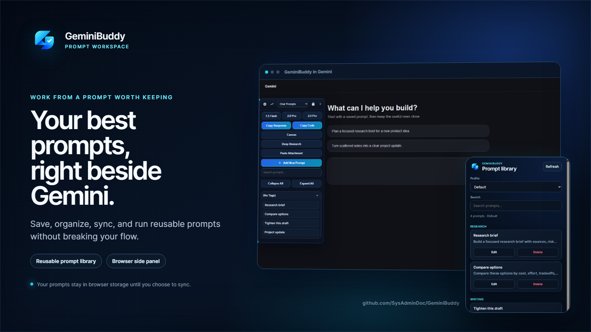
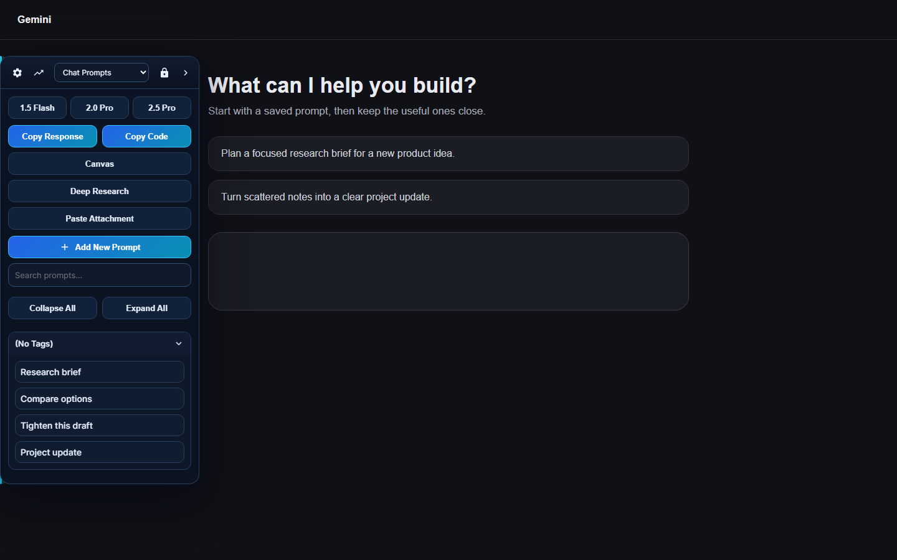
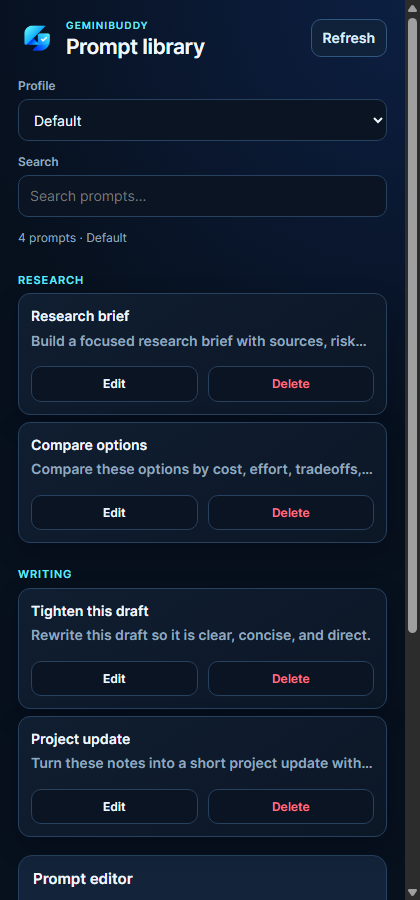
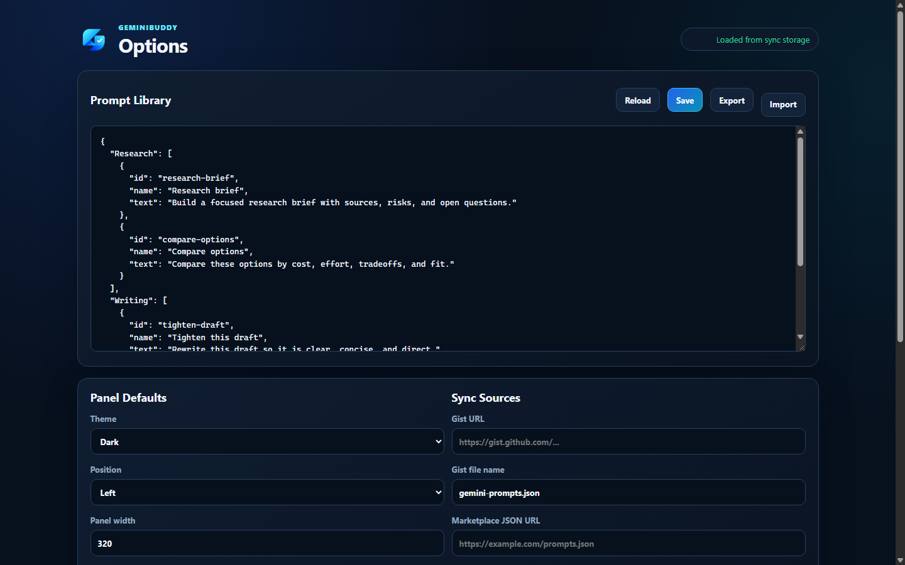

# GeminiBuddy

[](https://github.com/SysAdminDoc/GeminiBuddy/releases/latest) [](LICENSE) [](#install) [](#userscript)

GeminiBuddy keeps reusable prompts beside Gemini, where they're easy to search, edit, and run. Use the in-page panel for fast prompt work or open the browser side panel when you want your library without covering the conversation.

[Download the browser extension](https://github.com/SysAdminDoc/GeminiBuddy/releases/latest/download/geminibuddy-mv3-v54.0.1.zip) · [Install the userscript](https://raw.githubusercontent.com/SysAdminDoc/GeminiBuddy/main/GeminiBuddy.user.js) · [Report a problem](https://github.com/SysAdminDoc/GeminiBuddy/issues)

## Why GeminiBuddy

Prompt libraries usually end up in a notes app, a document, or an old chat. GeminiBuddy puts them back in the work:

- Search and run saved prompts without leaving Gemini.
- Keep separate libraries and settings in account-aware or manual profiles.
- Chain follow-up prompts and pass the previous response into the next step.
- Sync through browser storage, a GitHub Gist, JSON backups, or approved prompt catalogs.

## See it in action

### Work from the Gemini page

The slide-out panel stays tucked against either edge until you need it. Pin it open, filter the library, launch a saved prompt, or reach Canvas and Deep Research from the same surface.



### Browse prompts from the browser side panel

Saved prompts appear before the editor, so the first thing you see is the library you came to use. Pick a profile, search, run a prompt, or add another one.



### Manage sync and backups

The options page exposes the underlying prompt JSON, panel defaults, approved import origins, and redacted diagnostics.



## Install

### Browser extension

The ZIP is the normal self-hosted install:

1. Download [geminibuddy-mv3-v54.0.1.zip](https://github.com/SysAdminDoc/GeminiBuddy/releases/latest/download/geminibuddy-mv3-v54.0.1.zip).
2. Extract it to a folder you plan to keep.
3. Open your browser's extensions page and turn on Developer mode.
4. Choose **Load unpacked**, then select the extracted folder.

In Chrome or Edge, the toolbar button opens GeminiBuddy's side panel. The same package injects the slide-out prompt panel on `gemini.google.com`.

The release also includes a CRX3 file for managed Chromium installs and compatible browsers. Modern Chrome and Edge normally reject drag-and-drop installation of self-hosted CRX files, so the ZIP remains the recommended choice.

### Userscript

1. Install Tampermonkey or Violentmonkey.
2. Open [GeminiBuddy.user.js](https://raw.githubusercontent.com/SysAdminDoc/GeminiBuddy/main/GeminiBuddy.user.js).
3. Approve the install in your userscript manager.
4. Visit [Gemini](https://gemini.google.com/).

The userscript includes update and download URLs, so compatible managers can check this repository for new releases.

## What it can do

| Area | What you get |
| --- | --- |
| Prompt library | Groups, tags, favorites, pinning, search, drag ordering, import, export, and share links |
| Prompt workflows | Optional auto-send, chained steps, previous-response handoff, Gem URLs, and prompt history |
| Gemini controls | Model shortcuts, Canvas, Deep Research, clipboard attachments, response copy, and code copy |
| Profiles | Account-aware and manual profiles with separate prompts, settings, and history |
| Sync | Browser sync storage, Gist pull and push, approved marketplace catalogs, and JSON backups |
| Support | Redacted diagnostics with version, storage, profile, selector, and recent error details |

## Privacy and permissions

GeminiBuddy doesn't require a hosted account. Prompts stay in browser-managed storage unless you choose to import, export, share, or sync them.

API keys and GitHub tokens use local-only secret storage. They aren't included in prompt exports. The extension requests access to Gemini plus the GitHub and Google endpoints used by its optional sync and API features. Custom catalog origins require an explicit HTTPS allowlist or a one-time browser permission.

GeminiBuddy is an independent open-source project. It isn't affiliated with or endorsed by Google.

## Build and verify

Requirements: Node.js 20 or newer, plus Chrome or Edge for the clean-profile browser check.

```powershell
node chrome_extension/build-release.mjs
node chrome_extension/i18n-check.js
node --test tests/*.test.js
node tests/mv3-smoke.js
```

The release build creates an unpacked extension, versioned ZIP, signed CRX3, and SHA-256 manifest under `chrome_extension/dist`. The first release build creates a local self-host key, and later builds reuse it so the extension ID stays stable.

The smoke check uses a temporary browser profile and a local Gemini-style fixture. It doesn't touch your normal browser profile or active window.

## Project layout

| Path | Purpose |
| --- | --- |
| `GeminiBuddy.user.js` | Installable userscript and MV3 content script |
| `chrome_extension/` | Manifest, side panel, options page, storage bridge, and packaging |
| `Prompts/defaultpromptlist.json` | Default prompt library |
| `tests/` | Storage, accessibility, workflow, security, and clean-profile checks |
| `concepts/marketing/2026-09-13/` | Selected marketing assets, starting screenshots, rejected concepts, source, and review notes |

## Contributing

Open an issue with your browser version, install method, and a short set of reproduction steps. Pull requests should keep the userscript, MV3 package, version strings, and tests in sync.

See [CHANGELOG.md](CHANGELOG.md) for release history.

## License

[MIT](LICENSE)
